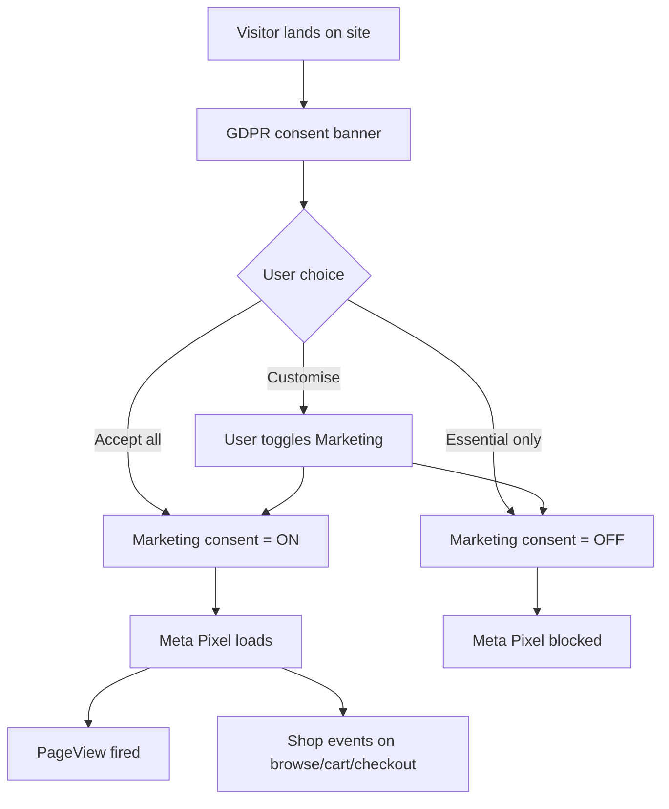
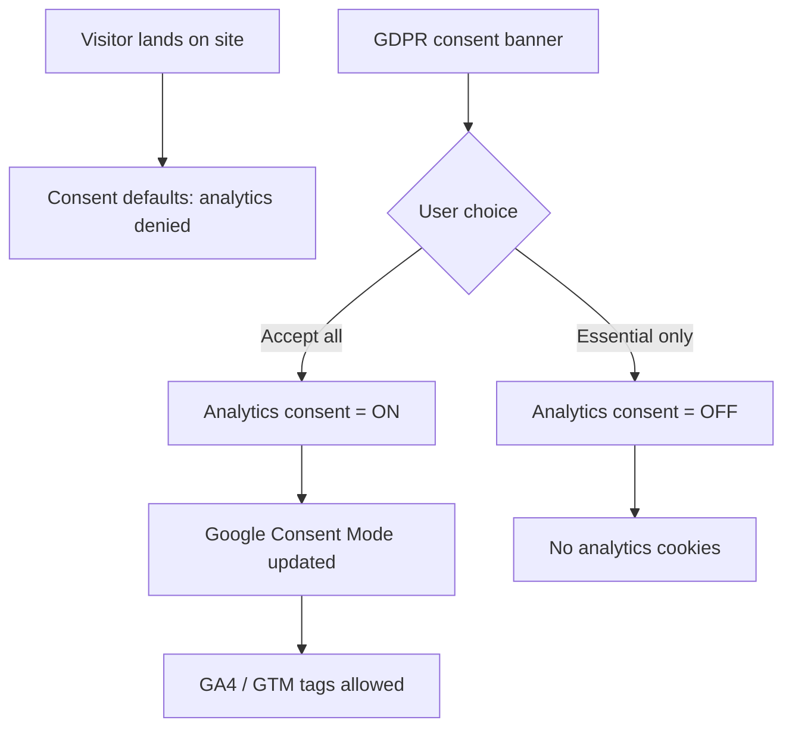
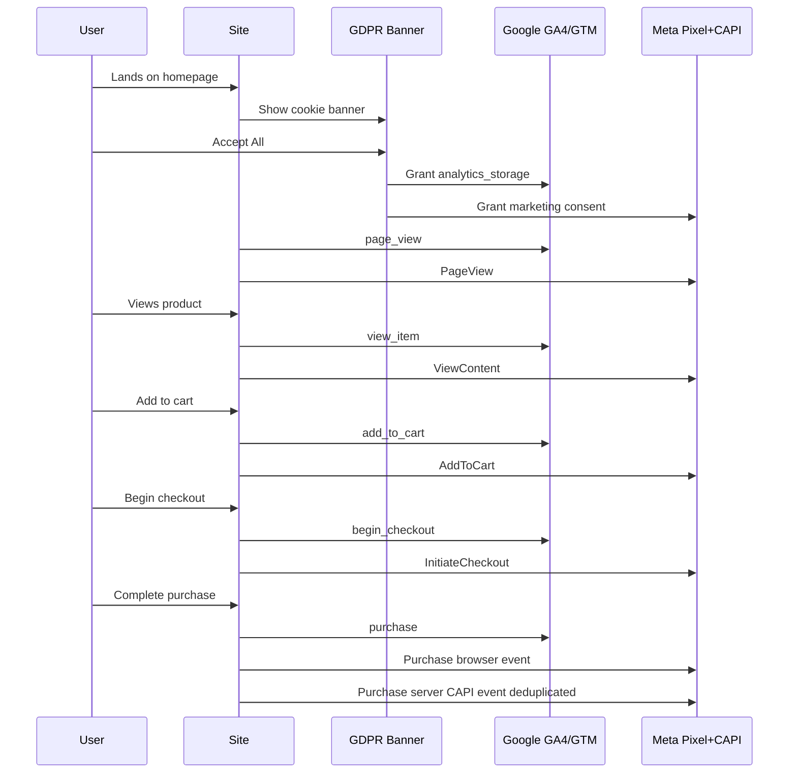

# House of Spells — SMM Team Guide
## Blog Management, Meta Pixel & Google Analytics

**Document version:** 1.0  
**Last updated:** June 2026  
**Audience:** Social Media Marketing team, content creators, campaign managers

---

## 1. Overview

The House of Spells website now includes:

| Capability | Status | Where to manage |
|------------|--------|-----------------|
| **Blog (public)** | Live | Visitors: `/blog` |
| **Blog CMS (editor)** | Live | Staff login: `/cms/blog` |
| **Google Analytics 4 / GTM** | Ready (needs IDs) | Google Tag Manager / GA4 |
| **Meta Pixel (browser)** | Ready (needs Pixel ID) | Meta Events Manager |
| **Meta Conversions API (CAPI)** | Ready (needs token) | Configured by engineering on server |

This guide explains what the SMM team can do directly, what engineering must configure once, and how to verify everything is working.

**Production site (current):**  
https://hos-marketplaceweb-production.up.railway.app

**Custom domain (when live):**  
https://houseofspells.com (or your configured `NEXT_PUBLIC_SITE_URL`)

---

## 2. Access you need (checklist)

Ask your engineering / admin contact to provision the following before you start.

### 2.1 Blog CMS access

| Item | Details |
|------|---------|
| **Login URL** | `{SITE_URL}/login` |
| **CMS URL** | `{SITE_URL}/cms/blog` |
| **Role required** | `CMS_EDITOR` or `ADMIN` |
| **Who creates accounts** | Admin via `/admin/users` |

After login, you will see **CMS → Blog Posts** in the sidebar, plus **Blog Categories**.

### 2.2 Meta (Facebook / Instagram ads)

| Item | Who sets it | Your access |
|------|-------------|-------------|
| **Meta Business Manager** | Business owner | Analyst or Advertiser role |
| **Meta Events Manager** | SMM / ads lead | Full access to Pixel + Test Events |
| **Pixel ID** | Created in Events Manager | Share with engineering (see Section 4) |
| **CAPI Access Token** | Generated in Events Manager | Share with engineering only — never publish publicly |

### 2.3 Google (Analytics & Ads)

| Item | Who sets it | Your access |
|------|-------------|-------------|
| **Google Analytics 4 property** | Marketing lead | Editor or Analyst |
| **Google Tag Manager container** | Marketing lead | Publish access (recommended) |
| **GTM Container ID** (`GTM-XXXXXXX`) | GTM Admin | Share with engineering |
| **GA4 Measurement ID** (`G-XXXXXXXXXX`) | GA4 Admin | Configure inside GTM *or* share with engineering |
| **Google Search Console** | Marketing lead | Owner / Full user |

---

## 3. Blog — User flow for content creators

### 3.1 High-level flow

```mermaid
flowchart TD
    login[Login at /login] --> cms[Open /cms/blog]
    cms --> choice{Action?}
    choice -->|New post| newPost[/cms/blog/new]
    choice -->|Edit post| editPost[/cms/blog/id/edit]
    choice -->|Categories| categories[/cms/blog/categories]
    newPost --> draft[Write content in TipTap editor]
    editPost --> draft
    draft --> seo[Fill SEO panel and featured image]
    seo --> saveDraft[Save Draft]
    seo --> publish[Publish]
    saveDraft --> preview[Preview optional]
    publish --> live[Post live at /blog/slug]
    live --> sitemap[Auto-added to XML sitemap]
    categories --> archive[Category page at /blog/category/slug]
```

### 3.2 Step-by-step: Create and publish a blog post

1. **Log in** at `/login` with your CMS_EDITOR account.
2. Go to **CMS → Blog Posts** (`/cms/blog`).
3. Click **+ Write Post** (`/cms/blog/new`).
4. Complete the main fields:
   - **Title** — headline shown on the site
   - **URL Slug** — auto-generated from title; editable (e.g. `how-to-run-meta-ads-for-edtech`)
   - **Author** — display name
   - **Excerpt** — short summary for listings and fallback meta description
   - **Content** — rich text editor (headings, bold, lists, images, links, tables, quotes)
5. **Featured image** (right panel):
   - Upload image (stored via site upload system)
   - **Alt text** — required for SEO
   - **Image title** — optional
6. **Category** — select from dropdown (manage categories at `/cms/blog/categories`).
7. **SEO panel** (right panel):
   - **SEO Title** — custom Google title (aim for ~60 characters)
   - **Meta Description** — custom snippet (aim for ~155 characters)
   - **Focus Keyword** — optional; panel shows basic checks (in title, slug, description)
   - **Canonical URL** — leave blank unless you need a custom canonical
   - **Google Preview** — live preview of how the snippet may appear
8. **Save Draft** — keeps post hidden from public `/blog`.
9. **Publish** — post goes live at `/blog/{slug}`.
10. **Preview** (edit screen only) — opens the public URL in a new tab.

### 3.3 Step-by-step: Manage categories

1. Go to **CMS → Blog Categories** (`/cms/blog/categories`).
2. **Add Category** — name, optional slug, optional description.
3. Published posts in that category appear on `/blog/category/{slug}`.
4. Default seeded categories (if migration ran): New York, Harry Potter, Stranger Things, Spiderman.

### 3.4 Public blog URLs (for sharing)

| Page | URL pattern |
|------|-------------|
| Blog home | `/blog` |
| Single article | `/blog/{slug}` |
| Category archive | `/blog/category/{slug}` |
| Search | `/blog?q=search-term` |
| Search + category | `/blog?q=term&category=harry-potter` |

### 3.5 SEO features (automatic)

The system handles these without extra steps:

- Clean URLs (`/blog/my-post-title`, not `?id=123`)
- **BlogPosting** + **Breadcrumb** schema (JSON-LD)
- **Table of Contents** — auto-generated when 2+ H2/H3 headings exist
- **Reading time** — calculated on save (e.g. “5 min read”)
- **Related articles** — same category, at bottom of post
- **XML sitemap** — `/blog`, each post, and each category included automatically

### 3.6 Blog editor tips

- Use **H2** for main sections and **H3** for subsections (helps ToC and SEO).
- Add **internal links** via the editor Link button (paste URLs to `/blog/...` or shop pages).
- Upload images in-content via the toolbar **Image** button.
- Do not paste raw `<script>` tags — content is sanitized server-side for security.

---

## 4. Meta Pixel — Setup & verification

### 4.1 What is implemented

| Layer | Description |
|-------|-------------|
| **Browser Pixel** | Loads `fbevents.js` after user accepts **Marketing** cookies |
| **PageView** | Fires on each page navigation |
| **Standard events** | ViewContent, AddToCart, InitiateCheckout, Purchase (mirrors shop actions) |
| **Conversions API** | Server-side duplicate events with matching `event_id` for deduplication |
| **GDPR** | Pixel does **not** fire until marketing consent is granted |

### 4.2 One-time setup (engineering)

Engineering adds these environment variables on the **web app** (Railway / hosting):

| Variable | Example | Notes |
|----------|---------|-------|
| `NEXT_PUBLIC_META_PIXEL_ID` | `123456789012345` | From Meta Events Manager → Pixel → Settings |
| `META_CONVERSIONS_API_TOKEN` | *(secret)* | Events Manager → Settings → Conversions API → Generate token |
| `META_TEST_EVENT_CODE` | `TEST12345` | Optional; use during testing only |

After deploy, remove `META_TEST_EVENT_CODE` in production.

### 4.3 SMM team setup in Meta Events Manager

1. **Create or select a Pixel** in [Meta Events Manager](https://business.facebook.com/events_manager).
2. Copy the **Pixel ID** → send to engineering for `NEXT_PUBLIC_META_PIXEL_ID`.
3. **Generate Conversions API token** → send to engineering securely (not via public chat).
4. Under **Test Events**, note the test code while validating (engineering sets `META_TEST_EVENT_CODE`).
5. In **Aggregated Event Measurement**, prioritize events if prompted:
   - Purchase
   - InitiateCheckout
   - AddToCart
   - ViewContent
   - PageView

### 4.4 Visitor consent flow (marketing pixel)



**Important for campaigns:** Retargeting audiences only include users who accepted **Marketing** cookies. Factor this into audience size expectations in the EU/UK.

### 4.5 How to verify Meta Pixel

1. Install [Meta Pixel Helper](https://chrome.google.com/webstore/detail/meta-pixel-helper) (Chrome).
2. Open the site in an incognito window.
3. Accept **Marketing** cookies on the banner.
4. Confirm Pixel Helper shows your Pixel ID and **PageView**.
5. In Events Manager → **Test Events**, browse the site and confirm events appear.
6. Test a product view, add to cart, and (if possible) a test purchase.
7. For CAPI: in Events Manager, check event details show **Browser** and **Server** with same `event_id` (deduplicated).

### 4.6 Events reference

| User action | Meta event name |
|-------------|-----------------|
| Any page load (after consent) | `PageView` |
| Product detail view | `ViewContent` |
| Add to cart | `AddToCart` |
| Checkout started | `InitiateCheckout` |
| Order completed | `Purchase` |

---

## 5. Google Analytics & Tag Manager — Setup & verification

### 5.1 What is implemented

| Layer | Description |
|-------|-------------|
| **GTM or GA4 direct** | Site supports either GTM container or standalone GA4 |
| **Consent Mode** | Default denied; updates when user accepts cookies |
| **Analytics events** | Page views, view_item, add_to_cart, begin_checkout, purchase |
| **GDPR** | GA4/GTM analytics storage denied until **Analytics** consent |

**Recommendation:** Use **GTM** as the single container for GA4, Google Ads, and any future tags. Avoid setting both `NEXT_PUBLIC_GTM_ID` and `NEXT_PUBLIC_GA_MEASUREMENT_ID` at the same time (duplicate page views).

### 5.2 One-time setup (engineering)

| Variable | Example | When to use |
|----------|---------|-------------|
| `NEXT_PUBLIC_GTM_ID` | `GTM-XXXXXXX` | **Recommended** — configure GA4 inside GTM |
| `NEXT_PUBLIC_GA_MEASUREMENT_ID` | `G-XXXXXXXXXX` | Only if not using GTM |
| `NEXT_PUBLIC_GOOGLE_SITE_VERIFICATION` | meta tag content | Google Search Console verification |

### 5.3 SMM team setup in Google Tag Manager

1. Create a GTM container for the production domain.
2. Share **Container ID** (`GTM-XXXXXXX`) with engineering.
3. Inside GTM, create tags:
   - **GA4 Configuration** tag with your Measurement ID
   - Trigger: Consent Initialization + page view (respect consent mode)
4. Link GA4 to Google Ads if running search/shopping campaigns.
5. **Publish** the GTM container after testing in Preview mode.

### 5.4 Visitor consent flow (Google analytics)



### 5.5 How to verify Google tracking

1. Open site in incognito; accept **Analytics** (or Accept all).
2. GTM **Preview** mode — confirm tags fire on page load and key pages.
3. GA4 **Realtime** report — confirm active users while you browse.
4. GA4 **DebugView** (optional) — with Google Analytics Debugger extension.
5. Complete test funnel: product view → add to cart → begin checkout → purchase (test order).
6. Confirm events in GA4: `view_item`, `add_to_cart`, `begin_checkout`, `purchase`.

### 5.6 GA4 events reference

| User action | GA4 event name |
|-------------|----------------|
| Page navigation | `page_view` |
| Product detail view | `view_item` |
| Add to cart | `add_to_cart` |
| Checkout started | `begin_checkout` |
| Order completed | `purchase` |

---

## 6. Combined tracking user journey (shop funnel)



---

## 7. Go-live checklist

### Engineering (before SMM verification)

- [ ] `NEXT_PUBLIC_META_PIXEL_ID` set on production web app
- [ ] `META_CONVERSIONS_API_TOKEN` set on production web app (server-only)
- [ ] `NEXT_PUBLIC_GTM_ID` or `NEXT_PUBLIC_GA_MEASUREMENT_ID` set
- [ ] `NEXT_PUBLIC_SITE_URL` matches live domain (sitemap, OG tags, canonical URLs)
- [ ] Blog database migration applied (`blog_posts`, `blog_categories` tables exist)
- [ ] CMS_EDITOR account(s) created for content team

### SMM team (after deploy)

- [ ] Log in to CMS; create and publish a test blog post
- [ ] Confirm test post at `/blog/{slug}` and in sitemap
- [ ] Meta Pixel Helper shows PageView after marketing consent
- [ ] Meta Test Events shows browser + server events
- [ ] GTM Preview / GA4 Realtime shows traffic after analytics consent
- [ ] Test purchase funnel events in both Meta and GA4
- [ ] Remove `META_TEST_EVENT_CODE` from production when done testing

---

## 8. Support & contacts

| Topic | Contact |
|-------|---------|
| CMS login / new editor accounts | Admin team (`/admin/users`) |
| Pixel ID / CAPI token deployment | Engineering / DevOps |
| GTM container ID deployment | Engineering / DevOps |
| Blog content or SEO questions | CMS_EDITOR users + marketing lead |
| Broken tracking after site update | Engineering with Events Manager screenshots |

---

## 9. Quick reference URLs

| Purpose | Path |
|---------|------|
| Public blog | `/blog` |
| Blog post | `/blog/{slug}` |
| Blog category | `/blog/category/{slug}` |
| CMS blog list | `/cms/blog` |
| New post | `/cms/blog/new` |
| Categories admin | `/cms/blog/categories` |
| Login | `/login` |
| XML sitemap | `/sitemap.xml` |

---

*This document reflects the implementation deployed in June 2026. If tracking or CMS behaviour changes, engineering will update this guide.*
